# Examen - RA6: Creació i Gestió d'un Projecte Web amb Git i Desplegament en Vercel

## 1. Configuració inicial
1. Comprova la versió instal·lada de Git i fes captura del terminal.  
   **Captura:** 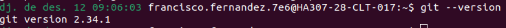

2. Configura Git al teu sistema (nom i email). Mostra la configuració actual per verificar-ho.  
   **Captura:** 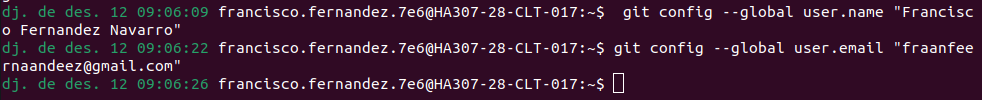

3. Inicia un nou repositori Git al directori `Cognom1Cognom2Examen2425`. Fes el primer commit.  
   **Captura:** 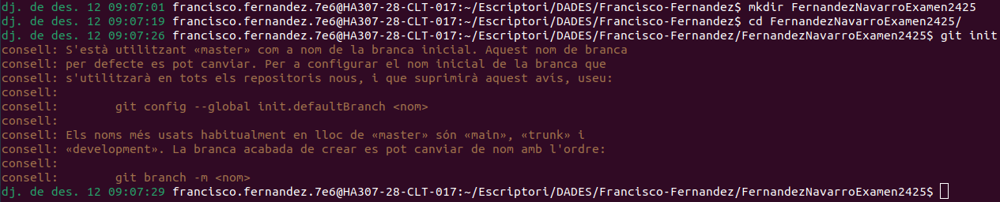
   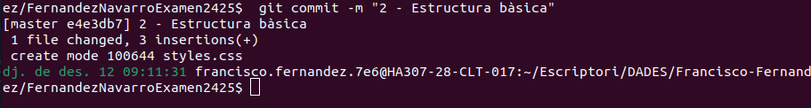

---

## 2. Creació del projecte web
1. Crea els fitxers següents al directori del projecte:  
   - `index.html`  
   - `testunitari.html`  
   - `style.css`  
   - `main.js`  
   Afegeix contingut bàsic a cada fitxer.
   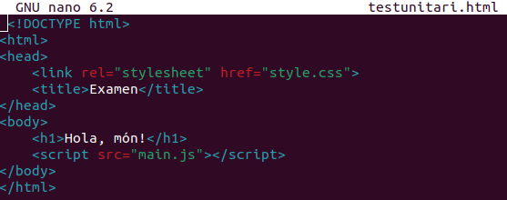
   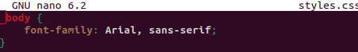
   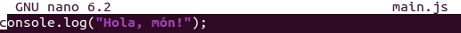

2. Verifica l’estat del repositori després d’afegir els fitxers.  
   **Captura:** 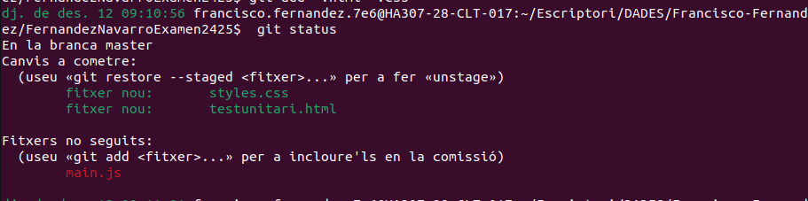

3. Elimina `testunitari.html` del staging i fes un commit amb el missatge **"2 - Estructura bàsica"**.  
   **Captura:** 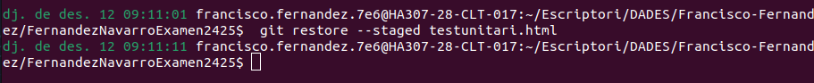
   

4. Consulta l’historial de commits.  
   **Captura:** 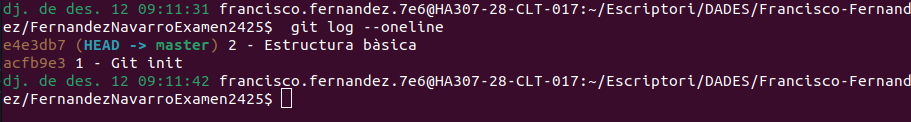

---

## 3. Creació de branques i documentació
1. Crea una branca nova anomenada `documentacio`.  
   **Captura:** 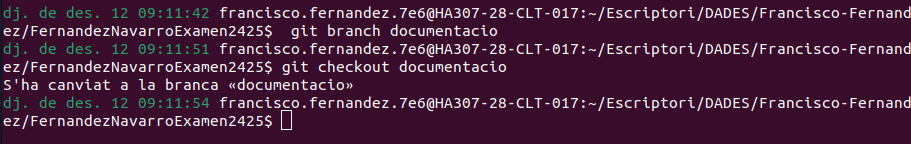

2. Torna a la branca `main` i fes un merge amb la branca `documentacio`.  
   **Captura:** 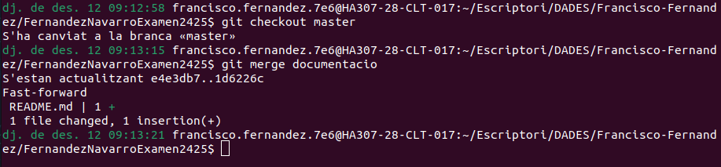

---

## 4. Remot i publicació
1. Configura un repositori remot a GitHub amb el nom `Cognom1Cognom2Examen2425`.  
   **Captura:** 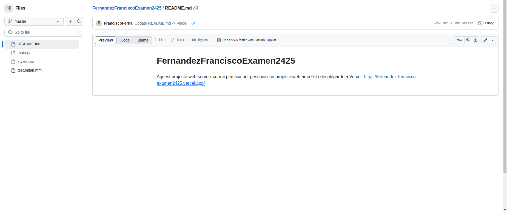

2. Puja els canvis al repositori remot.  
   **Captura:** `captures/git-push.png`

3. Publica el projecte a Vercel i copia l’enllaç generat.  
   **Enllaç de la pàgina publicada:** [Pàgina publicada](https://fernandez-francisco-examen2425.vercel.app/)  
   **Captura:** 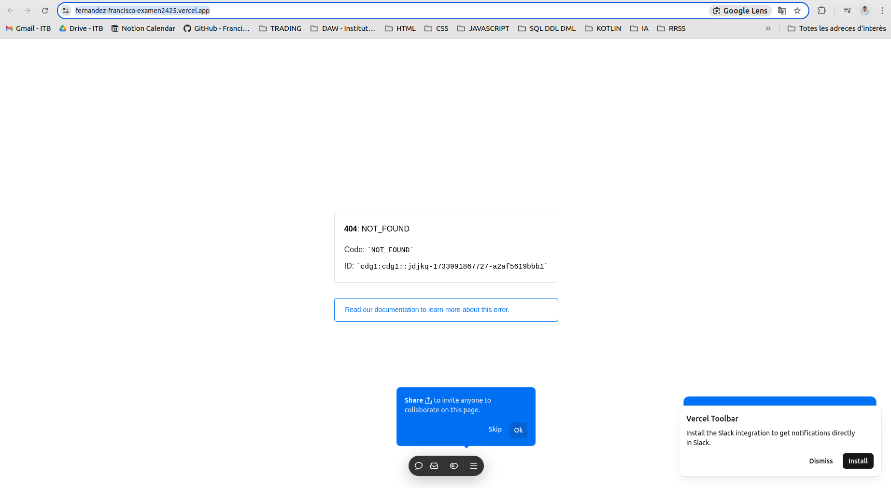

---

## 5. Verificació final
1. Penja totes les captures i aquest document a la branca `documentacio`.  
2. Comprova que tots els commits i fitxers estan al repositori remot.  
   **Captura:** 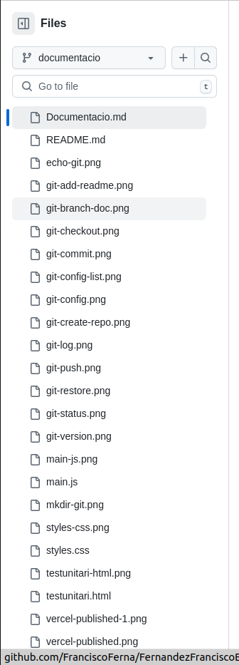
   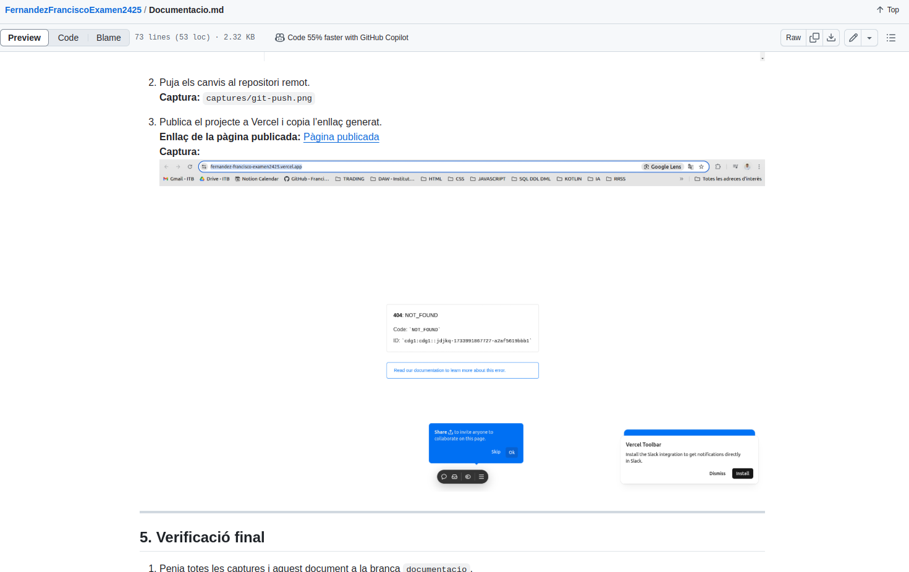

---

## Estructura del projecte
El directori hauria de contenir:  
- Fitxers del projecte (`index.html`, `style.css`, `main.js`)  
- Fitxer `README.md` completat.  
- Carpeta `captures/` amb les captures corresponents.

